# Veru

<div align="center">
  
  <h3>AI Citation Auditor & Hallucination Detector</h3>
  <p>Verify ChatGPT/Claude citations against real academic databases instantly.</p>
  <a href="https://veru.app"><strong>Visit Live Demo »</strong></a>
</div>

<br />


## 📖 About The Project

LLMs like ChatGPT often hallucinate academic citations—inventing papers that sound real but don't exist. **Veru** acts as a forensic auditor for your research. 

It extracts citations from your text and cross-references them against massive academic databases to verify their existence and content accuracy.

### Demo
<div align="center">
  
</div>

### Key Features

* **🕵️‍♂️ Anti-Hallucination Extraction**: Uses Gemini 2.0 to strictly extract citations without "autocorrecting" user errors.
* **📚 Multi-Database Verification**:
    * **Tier 1**: Checks **OpenAlex** (250M+ works) with smart title matching.
    * **Tier 2**: Fallback to **Semantic Scholar** if OpenAlex misses.
    * **Tier 3**: Final forensic sweep using **Google Search Grounding**.
* **🧠 Content Consistency Check**: Compares the user's claim against the *actual* abstract to detect mismatched summaries ("stitched" hallucinations).
* **💾 Local History**: Automatically saves your audit sessions locally (no login required).

### 🧠 How It Works (The Audit Pipeline)

```mermaid
graph TD
    A[User Input] --> B(LLM Extraction)
    B --> C{OpenAlex Search}
    C -->|Found & High Confidence| D[✅ Verfied Real]
    C -->|Not Found| E{Semantic Scholar}
    E -->|Found| D
    E -->|Not Found| F{Google Search Grounding}
    F -->|Verified| D
    F -->|Hallucinated| G[🛑 MARK AS FAKE]
    D --> H[Content Consistency Check]
    H -->|Match| I[Final Output]
    H -->|Mismatch| J[⚠️ Content Warning]
```



## 🛠 Tech Stack

* **Frontend**: Next.js 14 (App Router), Tailwind CSS, Lucide React
* **Backend**: Python FastAPI, Uvicorn, SlowAPI (Rate Limiting)
* **AI & Data**: Google Gemini 2.0 Flash, OpenAlex API, Semantic Scholar API
* **Deployment**: Vercel (Frontend) + Render (Backend)

## 🚀 Getting Started

Follow these steps to run Veru locally.

### Prerequisites

* Node.js 18+
* Python 3.9+
* A Google Gemini API Key (Get one from [Google AI Studio](https://aistudio.google.com/))

### Installation

1.  **Clone the repo**
    ```sh
    git clone https://github.com/Yinghao-Guan/Veru.git
    cd Veru
    ```

2.  **Setup Backend**
    ```sh
    cd audit_backend
    python -m venv venv
    source venv/bin/activate  # On Windows use `venv\Scripts\activate`
    pip install -r requirements.txt
    
    # Create .env file
    echo "GEMINI_API_KEY=your_api_key_here" > .env
    
    # Run server
    python main.py
    ```
    The backend will run on `http://localhost:8000`.

3.  **Setup Frontend**
    Open a new terminal:
    ```sh
    cd frontend
    npm install
    
    # Run development server
    npm run dev
    ```
    The frontend will run on `http://localhost:3000`.

## 🛡️ Security

* **Rate Limiting**: Backend is protected by `slowapi` to prevent abuse.
* **CORS**: Restricted to production domains and localhost.
* **No Data Retention**: We do not store user queries on our servers (history is local-only).

## 🤝 Contributing

Contributions are what make the open source community such an amazing place to learn, inspire, and create. Any contributions you make are **greatly appreciated**.

1.  Fork the Project
2.  Create your Feature Branch (`git checkout -b feature/AmazingFeature`)
3.  Commit your Changes (`git commit -m 'Add some AmazingFeature'`)
4.  Push to the Branch (`git push origin feature/AmazingFeature`)
5.  Open a Pull Request

## 📄 License

Distributed under the MIT License. See `LICENSE` for more information.

## 🙏 Acknowledgments

* [OpenAlex](https://openalex.org/) for their incredible open data.
* [Semantic Scholar](https://www.semanticscholar.org/) for the academic graph API.
* [Google Gemini](https://deepmind.google/technologies/gemini/) for the reasoning engine.

If you find this project interesting, please give it a ⭐️ on GitHub! It helps a lot.
